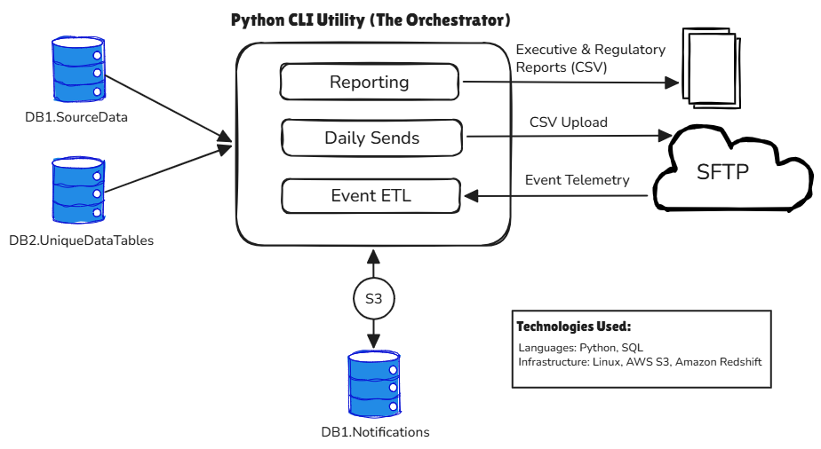

# Global Data Privacy Notification Engine

### Executive Summary  
This repository serves as a technical case study for an automated, high-assurance notification system designed to 
meet global data privacy regulations (GDPR/CCPA) for an enterprise dataset of 87M+ business contact records 
across 63 countries. The Challenge: Transitioning a manual, error-prone "daily query" process into a hardened, 
100% auditable production pipeline capable of processing 200K–500K records daily.

### Project Architecture: Automated Compliance & ETL Utility
**Modular Console Application (Python)**: A centralized CLI tool engineered to handle the three critical phases of the 
notification lifecycle:
1. **Outbound Pipeline**: Consolidates multi-source production data, validates against "already-sent" master records, 
and executes secure SFTP transfers of daily send files (200K–500K rows).
2. **Inbound ETL Engine**: Automates the retrieval of email event telemetry from vendor SFTP sites to Linux/S3, 
performing the ETL required to ingest data into the Redshift "Master Event" tables.
3. **Reporting Module**: Programmatically executes complex SQL queries to generate standardized CSV extracts for 
executive and regulatory stakeholders.

**High-Scale Relational Backend (Amazon Redshift)**: A robust schema of 10+ tables managing hundreds of millions of rows. 
Designed for high-durability tracking of data subject history, ensuring 1:1 traceability for Customer Service and audit 
requests.

**Operational Hand-off & Tooling**: Standardized the codebase via GitHub and implemented a Jupyter Notebook utility for 
Word-to-HTML template conversion, enabling 100% of routine execution to be managed by the Data Operations team.

  

### Key Technical Challenges & Solutions
1. Data Integrity at Scale (The "Double-Send" Risk)  
**Problem**: Identifying unique, "not-yet-notified" data subjects within a ~90M record backlog while simultaneously 
ingesting millions of new email events (deliveries/opens/bounces/clicks) from vendors.  
**Solution**: Engineered a high-performance validation layer in SQL that compares daily candidate pools against the 
"Already Sent" master tables, performs email address validity checks using Regex, and validates email quality by 
referencing unique data tables maintained by Verification Services. By utilizing Redshift’s DISTKEY/SORTKEY settings 
for optimized join keys, the system ensures 100% deduplication and prevents costly redundant notifications. 
2. Optimizing High-Volume ETL (The Inbound Engine)  
**Problem**: Ingesting multi-million row event files from vendor SFTP sites without degrading performance for 
concurrent executive reporting.  
**Solution**: Implemented a "Staging-to-Master" design pattern. Raw data is first loaded into ephemeral staging tables 
via AWS S3 (COPY command), allowing for bulk validation and transformation before being merged into the master event 
history. This approach maximizes throughput and maintains high availability for downstream BI tools. 
3. Zero-Fail Audit Traceability  
**Problem**: Regulatory requirements demand proof of delivery for every individual data subject.  
**Solution**: Developed a "Master Event" table that maps every outgoing CSV row to its corresponding vendor event ID. This 
allows for 100% traceability from a Customer Service request back to the specific source data. 
4. Operational Hand-off & Scaling  
**Problem**: The system needed to transition from an Engineering-led POC to a stable, Ops-managed utility.  
**Solution**: Standardized the codebase in GitHub and developed a Jupyter Notebook utility for template conversion 
(Word to HTML). This allowed non-technical Ops teams to manage the routine execution while I focused on architectural 
updates.

### Impact & Metrics
**Scale**: Successfully processed 37M+ notifications across 28 countries to date.  
**Efficiency**: Reduced manual engineering effort by 100% for routine send/collection tasks.  
**Reliability**: Established a framework for both initial notifications and periodic re-notification cycles, ensuring 
long-term regulatory compliance.

### Tech Stack
**Languages**: Python 3.9, SQL (Postgres/Redshift flavor), Linux, AWS CLI  
**Infrastructure**: Amazon Redshift, AWS S3, Linux SFTP  
**Tools**: PyCharm, SQLWorkbench/J, Jupyter Notebook, GitHub  

### Implementation Note
Due to the proprietary nature of the production environment, this repository contains architectural documentation and 
sanitized logic patterns rather than raw source code.